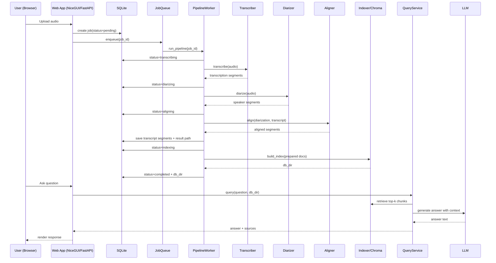

# MeetBot Detailed Architecture

## 1) Component responsibilities

- **Frontend (`meetbot/web/pages`, `meetbot/web/components`)**
  - Render pages and reusable UI widgets.
  - Collect upload/query input.
  - Display live progress and chat streams.

- **Backend Web Layer (`meetbot/web/api.py`, `meetbot/web/ws.py`, `meetbot/web/ws_chat.py`)**
  - Exposes REST endpoints and WebSocket channels.
  - Validates requests, checks job state, delegates work to services.

- **Workers (`meetbot/workers`)**
  - Queue dispatcher + background thread execution.
  - Pipeline worker does full transcribe→index.
  - Reindex worker rebuilds vector DB from edited transcript.

- **Adapters (`meetbot/adapters`)**
  - Backend abstraction layer for pluggable ML providers:
    - transcribers (`local_whisper`, `huggingface`)
    - LLMs (`local_llm`, `hf_api`)
    - diarization and embeddings

- **Services (`meetbot/services`)**
  - Domain orchestration:
    - `transcriber`: ASR orchestration + chunk support
    - `diarizer`: speaker segmentation
    - `aligner`: speaker-text alignment
    - `prepare_docs`: chunk aligned transcript into docs
    - `indexer`: embed + persist vector DB
    - `query_service`: RAG retrieval + answer generation

- **Data layer (`meetbot.db.*`, runtime SQLite file)**
  - Persistent users, jobs, segments, chat sessions/messages.
  - Stores processing status/progress and output locations.

- **Artifacts (`results/`, `db/`, `prepared/`, `.cache_hf/`)**
  - Raw/transformed JSON results, vector index, prepared docs, model/cache files.

---

## 2) Full-sequence diagram

---

## 3) Data model (logical schema)

> Note: the repo imports `meetbot.db.models`, but DB package files are not currently present in this checkout. This section documents expected schema based on usage in web/worker/tests.

- **users**
  - `id` (PK)
  - `username` (unique)
  - `password_hash`
  - `display_name`
  - `is_admin`
  - `created_at`, `last_login`

- **jobs**
  - `id` (PK)
  - `user_id` (FK users.id)
  - `filename`, `original_filename`, `file_size`
  - `backend`, `language`, `min_speakers`, `max_speakers`
  - `status` (`pending/transcribing/diarizing/aligning/indexing/completed/failed/cancelled/reindexing`)
  - `progress`, `stage_progress`, `progress_message`, `error_message`
  - output paths: `transcription_json_path`, `diarization_json_path`, `result_json_path`, `db_dir`
  - `duration_seconds`, `started_at`, `completed_at`, `created_at`

- **segments**
  - `id` (PK)
  - `job_id` (FK jobs.id)
  - `start_time`, `end_time`
  - `speaker`, `text`

- **chat_sessions**
  - `id` (PK)
  - `job_id` (FK jobs.id)
  - `user_id` (FK users.id)
  - `title`, timestamps

- **chat_messages**
  - `id` (PK)
  - `session_id` (FK chat_sessions.id)
  - `role` (`user`/`assistant`/`system`)
  - `content`
  - optional source metadata JSON
  - timestamps

---

## 4) Concurrency and lifecycle

- Queue model: single FIFO queue (`JobQueue`) with worker thread(s) and stop event.
- Job cancellation: cancellation registry checked at stage boundaries.
- Progress propagation:
  - worker updates DB job row,
  - publishes in-memory progress manager updates,
  - WebSocket clients subscribe to job stream.
- Safe shutdown:
  - queue stop event,
  - worker loop exits gracefully,
  - GPU memory cleanup (`torch.cuda.empty_cache`) after run.

---

## 5) GPU and memory strategy

- **Whisper + Pyannote** are biggest memory consumers during processing.
- Indexing tries configured embedding device first, then catches OOM and retries CPU.
- Local LLM path uses quantized GGUF and configurable `LOCAL_LLM_GPU_LAYERS`.
- For 4GB GPUs: keep GPU layers low (0–8), shorter context, low max tokens.
- Explicit cache cleanup after pipeline and reindex workers helps prevent cross-stage VRAM fragmentation.
