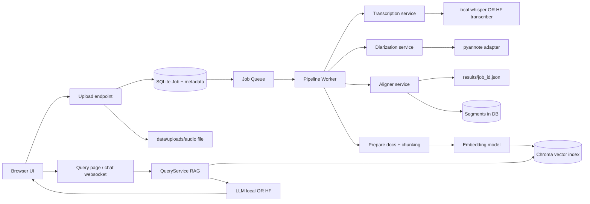

# MeetBot Overview (Beginner-Friendly)

## 1) What MeetBot does (end-to-end)
MeetBot is a web app that turns an audio file (like a meeting recording) into:
1. a transcript,
2. speaker labels (who spoke when),
3. a searchable vector index, and
4. a chat interface where you can ask questions about the meeting.

**User story**:
- You upload `meeting.mp3` in the web UI.
- A background worker runs multiple ML steps.
- When processing finishes, you open the Query page and ask: “What decisions were made?”
- MeetBot retrieves relevant transcript chunks and asks an LLM to answer using that context.

---

## 2) High-level components

### Web UI (NiceGUI + FastAPI)
- Pages: login, dashboard, upload, job details, query.
- Shows real-time progress and transcript tables.
- Uses REST and WebSockets.

### Upload + Job Creation
- Upload saves audio into `data/uploads`.
- App creates a DB job record and enqueues the job.

### Worker pipeline
1. **Transcribe** (Whisper local or HF Inference)
2. **Diarize** (Pyannote)
3. **Align** transcript segments with speaker segments
4. **Embed** aligned text chunks
5. **Index** vectors in ChromaDB

### Query / RAG
- Retrieve top-k matching chunks from Chroma.
- Build prompt from retrieved context.
- Generate answer using selected LLM backend.

### LLM backends
- **Local**: quantized GGUF model (llama.cpp wrapper)
- **HF API**: Hugging Face Inference provider

---

## 3) Data-flow diagram

---

## 4) Mental model for beginners
Think of MeetBot as **two systems working together**:
- **Processing system**: transforms raw audio into structured searchable knowledge.
- **Question-answering system**: reads that knowledge and answers natural-language questions.

If either system fails, debugging is easier when you isolate stages: upload, worker, index, query.
